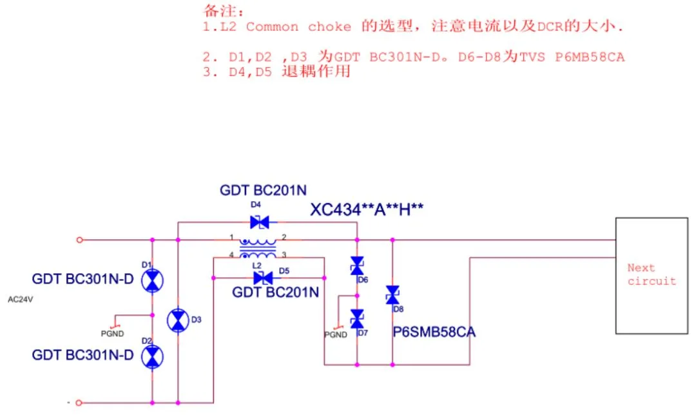

转自 [30种EMC标准电路分享，再不收藏就晚了！ (qq.com)](https://mp.weixin.qq.com/s/GiqMEAoSX26NdEBC7sAfXw)

不一定全用，比较重要的地方、又高压的地方就用。

01 **AC24V接口EMC设计标准电路**

02 **AC110V-220VEMC设计标准电路**

.jpg)

03 **AC380V接口EMC设计标准电路**

.jpg)

04 **AV接口EMC设计标准电路**

.jpg)

05 **CAN接口EMC设计标准电路**

.jpg)

06 **DC12V接口EMC设计标准电路**

.jpg)

07 **DC24V接口EMC设计标准电路**

.jpg)

08 **DC48接口EMC设计标准电路**

.jpg)

09 **DC110V接口EMC设计标准电路**

.jpg)

10 **DVI EMC设计标准电路**

.jpg)

11 **HDMI接口EMC设计标准电路**

.jpg)

12 **LVDS接口EMC设计标准电路**

.jpg)

13 **PS2接口EMC设计标准电路**

.jpg)

14 **RJ11EMC设计标准电路**

.jpg)

15 **RS232 EMC设计标准电路**

.jpg)

16 **RS485EMC设计标准电路**

.jpg)

17 **SCART接口EMC设计标准电路**

.jpg)

18 **s-video接口EMC设计标准电路**

.jpg)

19 **USB DEVICE EMC设计标准电路**

.jpg)

20 **USB2.0接口EMC设计标准电路**

.jpg)

21 **USB3.0接口EMC设计标准电路**

.jpg)

22 **VGA接口EMC设计标准电路**

.jpg)

23 **差分时钟EMC设计标准电路**

.jpg)

24 **耳机接口EMC设计标准电路**

.jpg)

25 **复合视频接口EMC设计标准电路**

.jpg)

26 **汽车零部件电源口EMC标准设计电路**

.jpg)

27 **室内外天馈浪涌设计标准电路**

.jpg)

28 **无源晶振EMC设计标准电路**

.jpg)

29 **有源晶振EMC设计标准电路**

.jpg)

30 **以太网EMC(EMI)设计标准电路**

.jpg)

31 **以太网EMC（浪涌）设计标准电路(差模要求较高方案）**

.jpg)

32 **以太网EMC(浪涌）中心抽头方案（节约空间）**

.jpg)

